This data set contains 11 variables which quantify the chemical properties of 
4,898 white wines. Each wine also has a quality rating determined by at least 
3 wine experts from 0(very bad) to 10 (very excellent).

# Univariate Plots Section


```
##  [1] "fixed.acidity"        "volatile.acidity"     "citric.acid"         
##  [4] "residual.sugar"       "chlorides"            "free.sulfur.dioxide" 
##  [7] "total.sulfur.dioxide" "density"              "pH"                  
## [10] "sulphates"            "alcohol"              "quality"
```

```
## [1] 4898   12
```

Without the id column, this data set has 4,898 observations and 12 
variables. Let's see what the contents of these variable look like.


```
## 'data.frame':	4898 obs. of  12 variables:
##  $ fixed.acidity       : num  7 6.3 8.1 7.2 7.2 8.1 6.2 7 6.3 8.1 ...
##  $ volatile.acidity    : num  0.27 0.3 0.28 0.23 0.23 0.28 0.32 0.27 0.3 0.22 ...
##  $ citric.acid         : num  0.36 0.34 0.4 0.32 0.32 0.4 0.16 0.36 0.34 0.43 ...
##  $ residual.sugar      : num  20.7 1.6 6.9 8.5 8.5 6.9 7 20.7 1.6 1.5 ...
##  $ chlorides           : num  0.045 0.049 0.05 0.058 0.058 0.05 0.045 0.045 0.049 0.044 ...
##  $ free.sulfur.dioxide : num  45 14 30 47 47 30 30 45 14 28 ...
##  $ total.sulfur.dioxide: num  170 132 97 186 186 97 136 170 132 129 ...
##  $ density             : num  1.001 0.994 0.995 0.996 0.996 ...
##  $ pH                  : num  3 3.3 3.26 3.19 3.19 3.26 3.18 3 3.3 3.22 ...
##  $ sulphates           : num  0.45 0.49 0.44 0.4 0.4 0.44 0.47 0.45 0.49 0.45 ...
##  $ alcohol             : num  8.8 9.5 10.1 9.9 9.9 10.1 9.6 8.8 9.5 11 ...
##  $ quality             : int  6 6 6 6 6 6 6 6 6 6 ...
```

```
##  fixed.acidity    volatile.acidity  citric.acid     residual.sugar  
##  Min.   : 3.800   Min.   :0.0800   Min.   :0.0000   Min.   : 0.600  
##  1st Qu.: 6.300   1st Qu.:0.2100   1st Qu.:0.2700   1st Qu.: 1.700  
##  Median : 6.800   Median :0.2600   Median :0.3200   Median : 5.200  
##  Mean   : 6.855   Mean   :0.2782   Mean   :0.3342   Mean   : 6.391  
##  3rd Qu.: 7.300   3rd Qu.:0.3200   3rd Qu.:0.3900   3rd Qu.: 9.900  
##  Max.   :14.200   Max.   :1.1000   Max.   :1.6600   Max.   :65.800  
##    chlorides       free.sulfur.dioxide total.sulfur.dioxide    density      
##  Min.   :0.00900   Min.   :  2.00      Min.   :  9.0        Min.   :0.9871  
##  1st Qu.:0.03600   1st Qu.: 23.00      1st Qu.:108.0        1st Qu.:0.9917  
##  Median :0.04300   Median : 34.00      Median :134.0        Median :0.9937  
##  Mean   :0.04577   Mean   : 35.31      Mean   :138.4        Mean   :0.9940  
##  3rd Qu.:0.05000   3rd Qu.: 46.00      3rd Qu.:167.0        3rd Qu.:0.9961  
##  Max.   :0.34600   Max.   :289.00      Max.   :440.0        Max.   :1.0390  
##        pH          sulphates         alcohol         quality     
##  Min.   :2.720   Min.   :0.2200   Min.   : 8.00   Min.   :3.000  
##  1st Qu.:3.090   1st Qu.:0.4100   1st Qu.: 9.50   1st Qu.:5.000  
##  Median :3.180   Median :0.4700   Median :10.40   Median :6.000  
##  Mean   :3.188   Mean   :0.4898   Mean   :10.51   Mean   :5.878  
##  3rd Qu.:3.280   3rd Qu.:0.5500   3rd Qu.:11.40   3rd Qu.:6.000  
##  Max.   :3.820   Max.   :1.0800   Max.   :14.20   Max.   :9.000
```
The median and mean of the quality of these wines are close together (about a 6 points). The middle 50% of the ratings are between 5 and 6 points. No wine received a perfect 10 points. Also, no wine received a perfectly terrible score of 0 points.

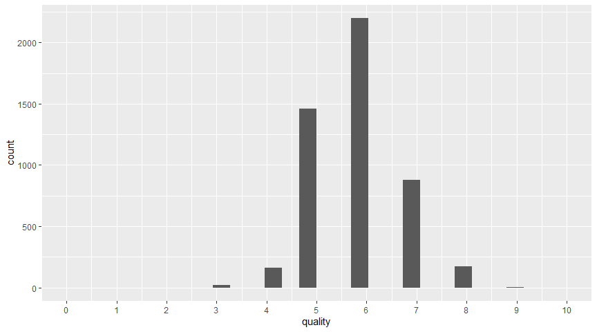


```
## [1] 1640
```
1,640 white wines were received a rating less than 6.

```
## [1] 2198
```
2,198 white wines were received a rating exactly equal to 6.

```
## [1] 1060
```
1,060 white wines were received a rating more than 6. A 6 rating seems about 
average. Were there any exceptional wine ratings? The numbers do not have any
meaning by themselves. Lets change that.

Below shows rating information where a quality score of 0-4 is "Poor", 
5-6 is "Good", 7-9 is "Very Good", and 10 is "Exceptional". 


```
## 
##        Poor        Good   Very Good Exceptional 
##         183        3655        1060           0
```
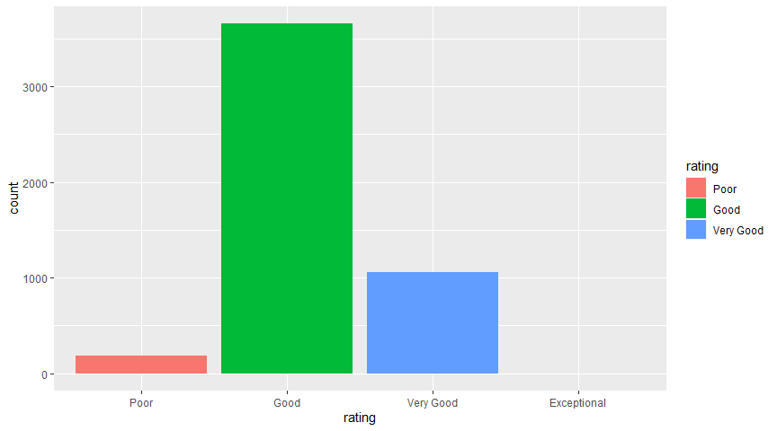

Based of this rating scheme, most wines were good, few were poor, and no wines 
had a perfect score of 10.

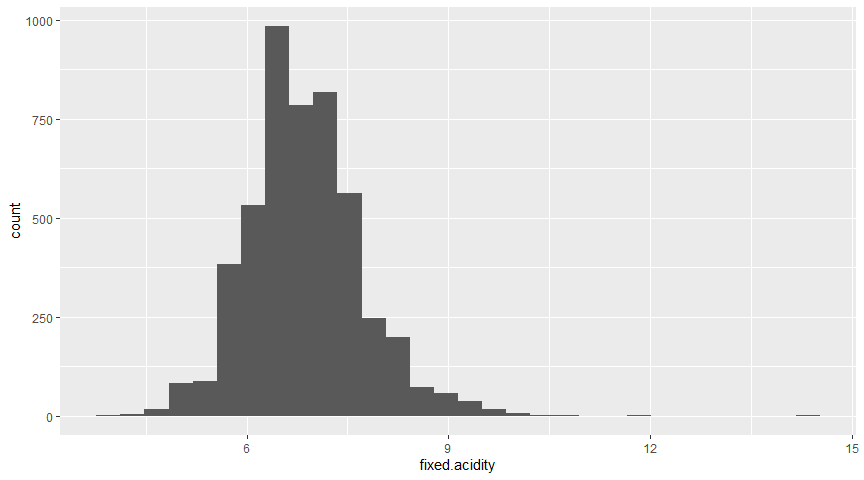

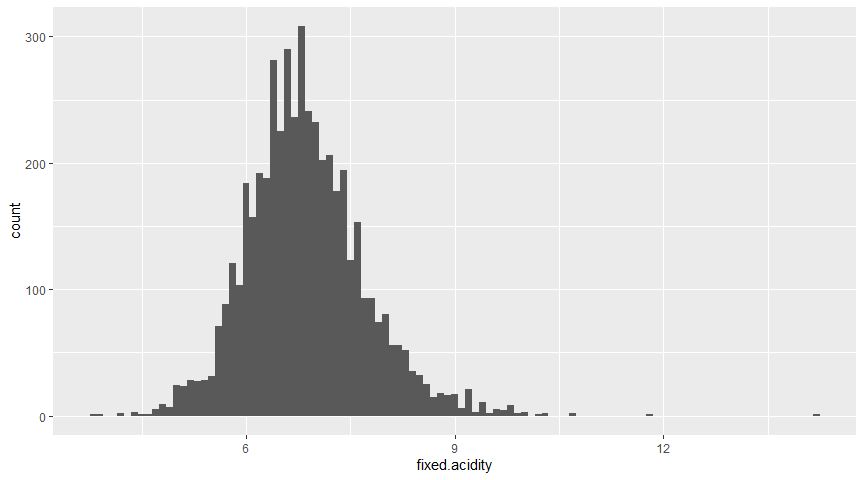

The fixed acidity seems to have a normal distribution but, some fixed, acidity 
levels seem more common than others. There also a few outliers where values are
closer to zero or greater than 9.

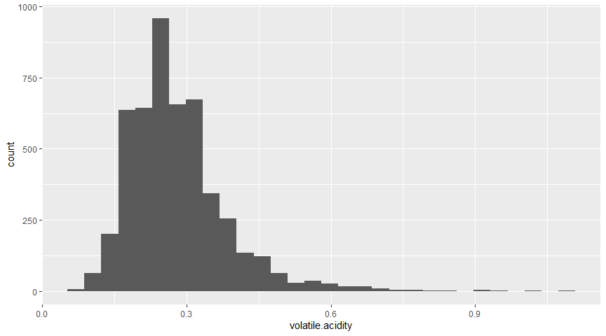
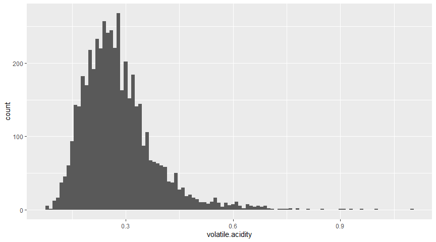

Volatile acidity is skewed to the right.

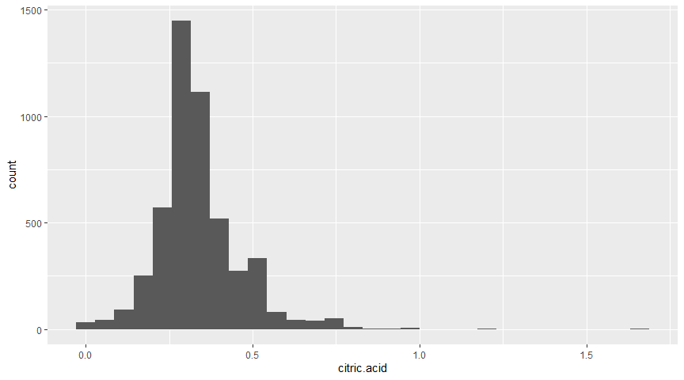
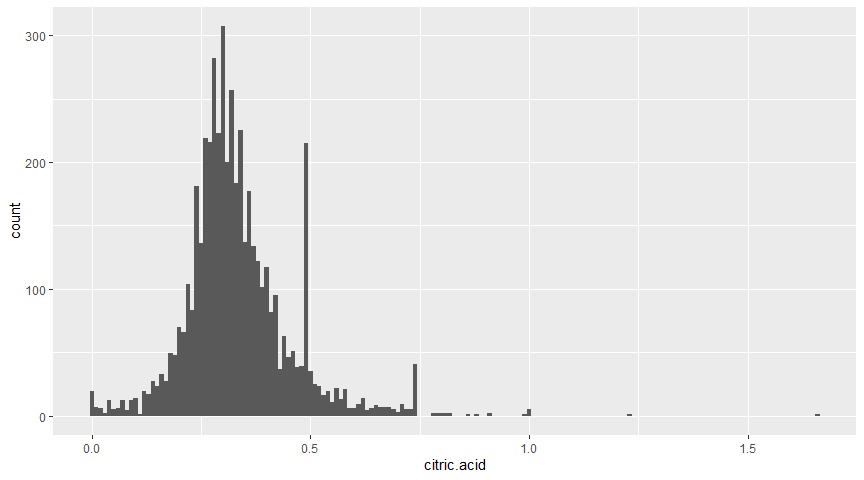

The  citric acid plot is also has a fairly normal distribution. 

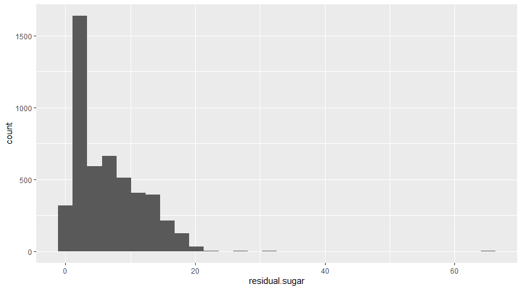
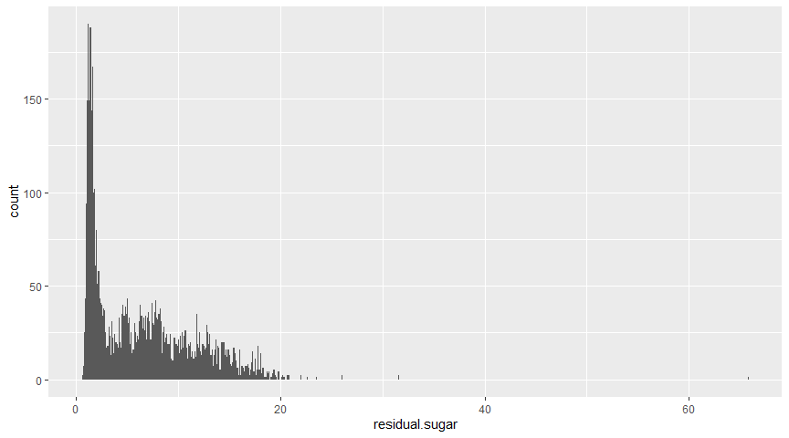

```
##    Min. 1st Qu.  Median    Mean 3rd Qu.    Max. 
##   0.600   1.700   5.200   6.391   9.900  65.800
```

```
## 
##   0.6   0.7   0.8   0.9  0.95     1  1.05   1.1  1.15   1.2  1.25   1.3  1.35 
##     2     7    25    39     4    93     1   146     3   187     3   147     2 
##   1.4  1.45   1.5  1.55   1.6  1.65   1.7  1.75   1.8  1.85   1.9  1.95     2 
##   184     4   142     2   165     2    99     1    99     3    59     2    79 
##  2.05   2.1   2.2  2.25   2.3  2.35   2.4   2.5   2.6  2.65   2.7   2.8  2.85 
##     1    51    56     2    42     1    41    40    33     1    38    36     1 
##   2.9     3   3.1  3.15   3.2   3.3   3.4   3.5   3.6   3.7  3.75   3.8  3.85 
##    25    17    17     1    28    23    13    31    22    12     2    21     3 
##   3.9  3.95     4   4.1   4.2  4.25   4.3  4.35   4.4  4.45   4.5  4.55   4.6 
##    17     3    19    17    31     2    19     1    14     3    33     2    40 
##   4.7  4.75   4.8  4.85   4.9     5   5.1  5.15   5.2  5.25   5.3  5.35   5.4 
##    29     5    38     1    35    43    28     2    29     4    17     2    23 
##  5.45   5.5  5.55   5.6   5.7   5.8  5.85   5.9  5.95     6   6.1   6.2   6.3 
##     2    13     1    16    30    23     2    19     1    23    21    31    39 
##  6.35   6.4   6.5  6.55   6.6  6.65   6.7  6.75   6.8  6.85   6.9  6.95     7 
##     1    34    26     1    30     3    25     1    28     6    20     1    31 
##  7.05   7.1   7.2  7.25   7.3  7.35   7.4  7.45   7.5   7.6   7.7  7.75   7.8 
##     2    36    29     2    19     2    40     1    30    29    34     2    41 
##  7.85   7.9  7.95     8   8.1  8.15   8.2  8.25   8.3   8.4  8.45   8.5  8.55 
##     1    32     1    32    34     1    36     2    31    13     1    24     1 
##   8.6  8.65   8.7  8.75   8.8   8.9  8.95     9  9.05   9.1  9.15   9.2  9.25 
##    27     1    18     2    22    23     1    18     1    17     2    22     2 
##   9.3   9.4   9.5  9.55   9.6  9.65   9.7   9.8  9.85   9.9    10 10.05  10.1 
##    11    10     9     1    18     4    22    16     3    18    18     3    14 
##  10.2  10.3  10.4  10.5 10.55  10.6 10.65  10.7  10.8  10.9    11  11.1  11.2 
##    23    16    25    16     1    22     1    26    17    11    19    18    18 
## 11.25  11.3  11.4 11.45  11.5  11.6  11.7 11.75  11.8  11.9 11.95    12 12.05 
##     2    12    14     1    11    15     8     4    35    16     3    16     1 
##  12.1 12.15  12.2  12.3  12.4  12.5 12.55  12.6  12.7 12.75  12.8 12.85  12.9 
##    21     4    15    13    19    16     2    16    16     1    25     4    25 
##    13  13.1 13.15  13.2  13.3  13.4  13.5 13.55  13.6 13.65  13.7  13.8  13.9 
##    19    23     1    13    16     7    10     3    12     4    21     8    18 
##    14 14.05  14.1 14.15  14.2  14.3 14.35  14.4 14.45  14.5 14.55  14.6  14.7 
##    16     1     4     1    20    17     3    17     3    17     3    13    14 
## 14.75  14.8  14.9 14.95    15  15.1 15.15  15.2 15.25  15.3  15.4  15.5 15.55 
##     2    12    14     2    13     7     1     6     1     9    17    11     6 
##  15.6  15.7 15.75  15.8  15.9    16 16.05  16.1  16.2  16.3  16.4 16.45  16.5 
##    14     9     1     6     2    10     6     2     7     7     5     1     3 
## 16.55  16.6 16.65  16.7 16.75  16.8 16.85  16.9 16.95    17 17.05  17.1  17.2 
##     1     2     5     5     2     4     4     3     3     1     1     5     9 
##  17.3 17.35  17.4 17.45  17.5 17.55  17.6  17.7 17.75  17.8 17.85  17.9 17.95 
##    14     1     2     2     8     3     2     1     4    13     5     2     3 
##    18 18.05  18.1 18.15  18.2  18.3 18.35  18.4  18.5  18.6 18.75  18.8  18.9 
##     2     3     6     8     3     2     4     1     1     1     4     3     1 
## 18.95  19.1 19.25  19.3 19.35  19.4 19.45  19.5  19.6  19.8  19.9 19.95 20.15 
##     3     1     3     4     1     2     3     2     1     4     1     3     1 
##  20.2  20.3  20.4  20.7  20.8    22  22.6  23.5 26.05  31.6  65.8 
##     2     1     1     2     2     2     1     1     2     2     1
```

The summary shows a large range of values for residual sugar. 75% of values are
below 9.9. The table shows that there is only one wine with a 65.8 value for 
residual sugar. The next highest level is at 31.6. Does sweetness have an impact
on quality ratings?
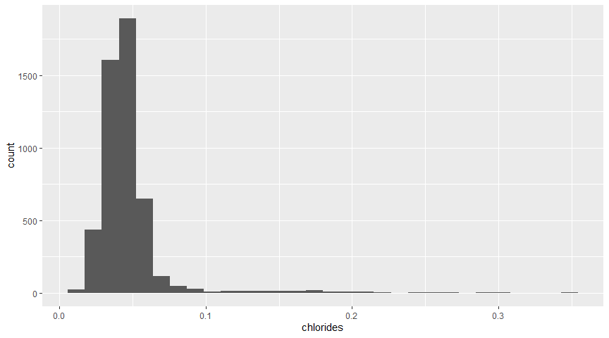

```
##    Min. 1st Qu.  Median    Mean 3rd Qu.    Max. 
## 0.00900 0.03600 0.04300 0.04577 0.05000 0.34600
```

Chlorides which are the salt content in wine seem to be relatively low. 75% of
values fall under .05 and the middle 50% of values are in the range of .036 to .05. However, the data skews to the right with a few values that are 
significantly higher. Would this affect the quality ratings? How much salt is too much?

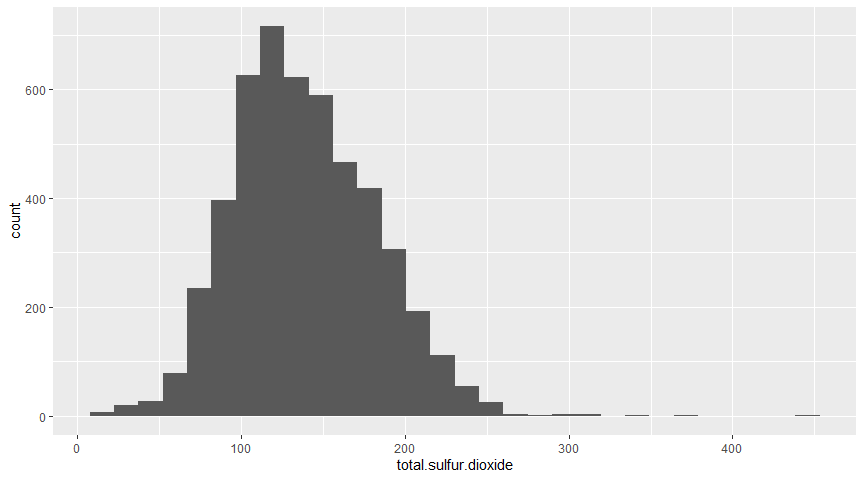
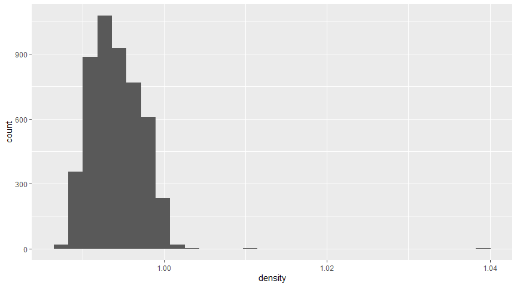
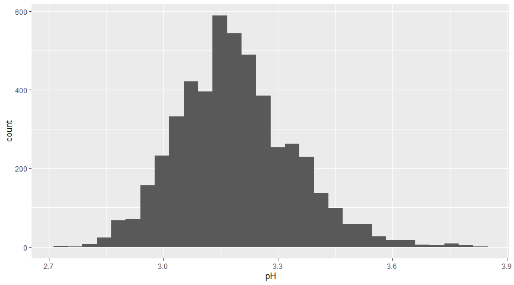

Most wines are stated have pH levels between 3.0 and 4.0. This plot shows this to be true although there is a small portion of wines that are more acidic at pH levels below 3.0. It would be interesting to see if this difference that seems small makes an impact on quality ratings.

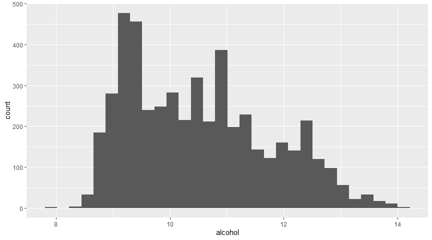
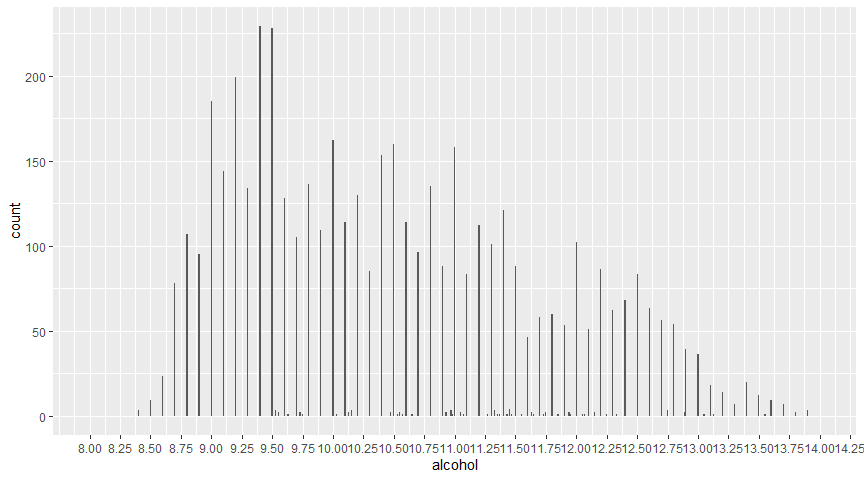

There generally seems to be less wines in the count as the alcohol content 
increases. Some spikes in the plot may be due to the value of the alcohol 
content being a whole number. Although other common numbers seem to be those
ending in .5.


# Univariate Analysis


### Dataset Structure

This data set consists of 4,898 wines. Each wine has 11 attributes and 1 quality
rating associated with it.

  - 1 - fixed acidity (tartaric acid - g / dm^3)
 - 2 - volatile acidity (acetic acid - g / dm^3)
 - 3 - citric acid (g / dm^3)
 - 4 - residual sugar (g / dm^3)
 - 5 - chlorides (sodium chloride - g / dm^3
 - 6 - free sulfur dioxide (mg / dm^3)
 - 7 - total sulfur dioxide (mg / dm^3)
 - 8 - density (g / cm^3)
 - 9 - pH
 - 10 - sulfates (potassium sulfate - g / dm^3)
 - 11 - alcohol (% by volume)
 - 12 - quality (score between 0 and 10)

### Main Features of Interest

Volatile acidity, residual sugar, and alcohol content stand out as variables 
that could easily impact the the taste and smell of wine. These along with the
quality ratings may let us know what makes a decent wine. For the purposes of this analysis, the free sulfur dioxide and sulfates attributes were left out because they seemed similar to the total sulfur dioxide attribute.

### Other Features of Interest

Sulfur dioxide which can be tasted if levels are too high.This could impact 
quality if detected by the wine testers. Density could also impact scores as it gives wine a different mouth feel. 

### New Variables

A rating variable was created from quality scores to give some meaning to the numbers .

### Unusual Distributions

Some chemical components were skewed to the right meaning, there were some outliers where wines had more of chemical in them than most of the other wines. These chemicals were, volatile acid, citric acid, residual sugar, and chlorides which all seem like chemicals that may not be wanted in to large of a quantity. 


# Bivariate Plots Section


```
##                           quality fixed.acidity volatile.acidity  citric.acid
## quality               1.000000000   -0.11366283      -0.19472297 -0.009209091
## fixed.acidity        -0.113662831    1.00000000      -0.02269729  0.289180698
## volatile.acidity     -0.194722969   -0.02269729       1.00000000 -0.149471811
## citric.acid          -0.009209091    0.28918070      -0.14947181  1.000000000
## residual.sugar       -0.097576829    0.08902070       0.06428606  0.094211624
## chlorides            -0.209934411    0.02308564       0.07051157  0.114364448
## total.sulfur.dioxide -0.174737218    0.09106976       0.08926050  0.121130798
## pH                    0.099427246   -0.42585829      -0.03191537 -0.163748211
## density              -0.307123313    0.26533101       0.02711385  0.149502571
## alcohol               0.435574715   -0.12088112       0.06771794 -0.075728730
##                      residual.sugar   chlorides total.sulfur.dioxide
## quality                 -0.09757683 -0.20993441         -0.174737218
## fixed.acidity            0.08902070  0.02308564          0.091069756
## volatile.acidity         0.06428606  0.07051157          0.089260504
## citric.acid              0.09421162  0.11436445          0.121130798
## residual.sugar           1.00000000  0.08868454          0.401439311
## chlorides                0.08868454  1.00000000          0.198910300
## total.sulfur.dioxide     0.40143931  0.19891030          1.000000000
## pH                      -0.19413345 -0.09043946          0.002320972
## density                  0.83896645  0.25721132          0.529881324
## alcohol                 -0.45063122 -0.36018871         -0.448892102
##                                pH     density     alcohol
## quality               0.099427246 -0.30712331  0.43557472
## fixed.acidity        -0.425858291  0.26533101 -0.12088112
## volatile.acidity     -0.031915368  0.02711385  0.06771794
## citric.acid          -0.163748211  0.14950257 -0.07572873
## residual.sugar       -0.194133454  0.83896645 -0.45063122
## chlorides            -0.090439456  0.25721132 -0.36018871
## total.sulfur.dioxide  0.002320972  0.52988132 -0.44889210
## pH                    1.000000000 -0.09359149  0.12143210
## density              -0.093591493  1.00000000 -0.78013762
## alcohol               0.121432099 -0.78013762  1.00000000
```
There seems to be a strong correlations between density vs alcohol and density vs residual sugar but, lets investigate this another way.

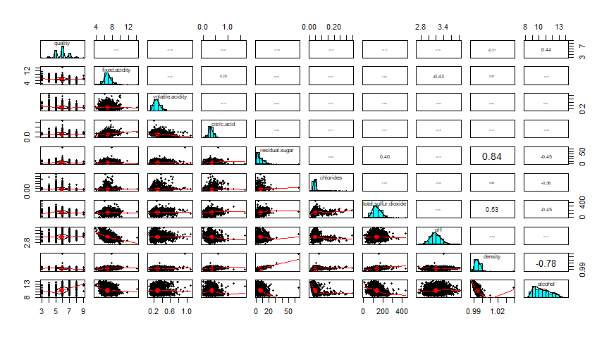


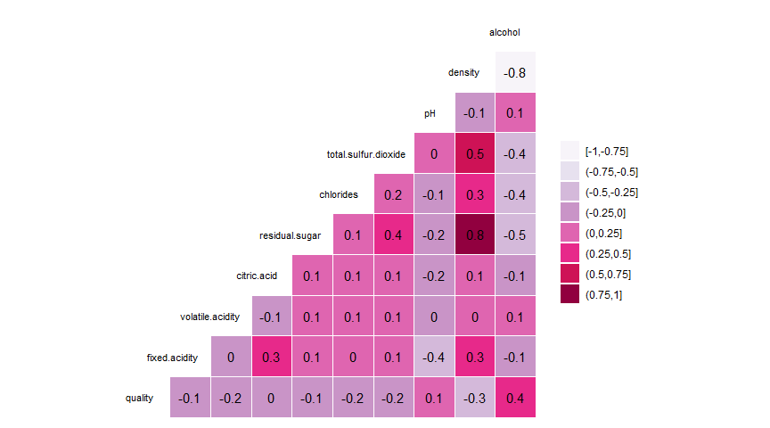

Each plot makes it easier to see that there seems to be a  negative correlation between  alcohol and density  and a positive correlation between residual sugar and density. This would makes sense because more liquids in a wine should make wine thinner than as opposed to sugar which would make the wine thicker or more syrupy.

Water has a density of approximately 1 g/cm^3. Density compared to residual sugars and alcohol will be interesting to explore.

Quality seems to be the most affected by density and alcohol content. 

Let's begin our exploration of residual sugar, alcohol, and density.

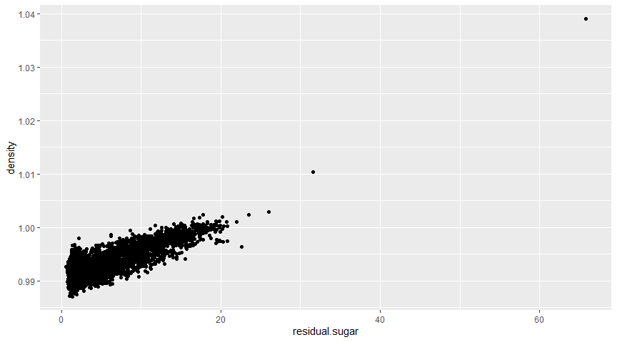


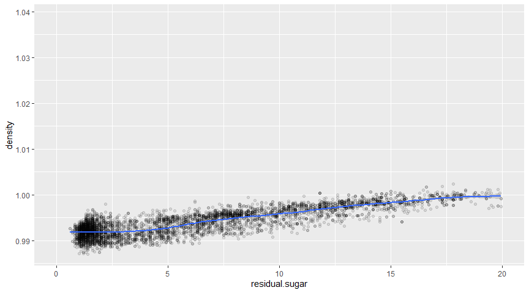

Most wines have a density less than water when looking at how much sugar is left in the wine. The wines that noticeably surpass the density of water are the outliers. After zooming in on the data, very few wines have a density of greater than 1.

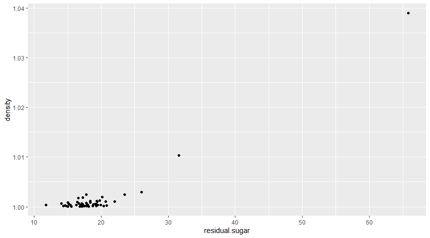

The fact that there are wines with low levels of residual sugars that are above the density of water means that something else is contributing to density. Density does not  increase only because of sugar content.

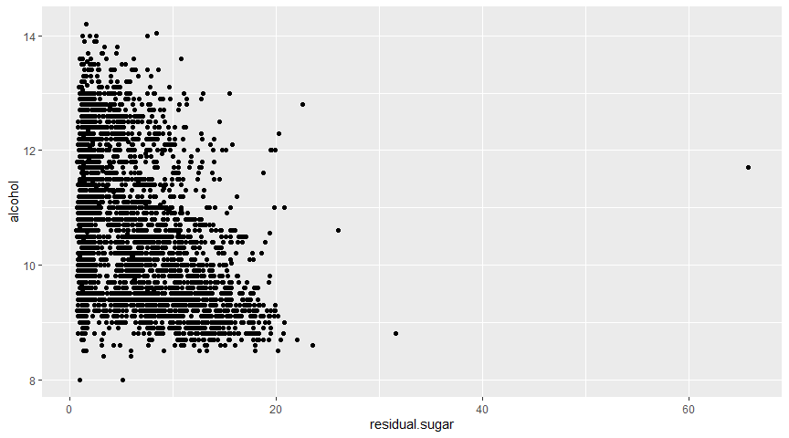

```
## [1] -0.4506312
```
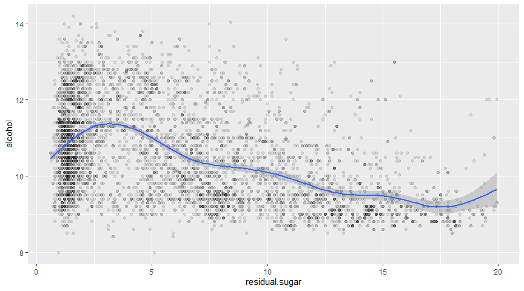

There does seem to be a somewhat of a correlation between sugar and alcohol content where wines with more sugar have less alcohol content.


```
## 
## 	Pearson's product-moment correlation
## 
## data:  less.sugar$residual.sugar and less.sugar$alcohol
## t = -36.307, df = 4878, p-value < 2.2e-16
## alternative hypothesis: true correlation is not equal to 0
## 95 percent confidence interval:
##  -0.4830522 -0.4388673
## sample estimates:
##        cor 
## -0.4612457
```
Checking the correlation without white wines with residual sugar greater than 20, it did increase some. We'll be conduct all further analysis pertaining to wines with residual sugar to those under 20 grams/dm^3.

How do these attributes compare with quality ratings?

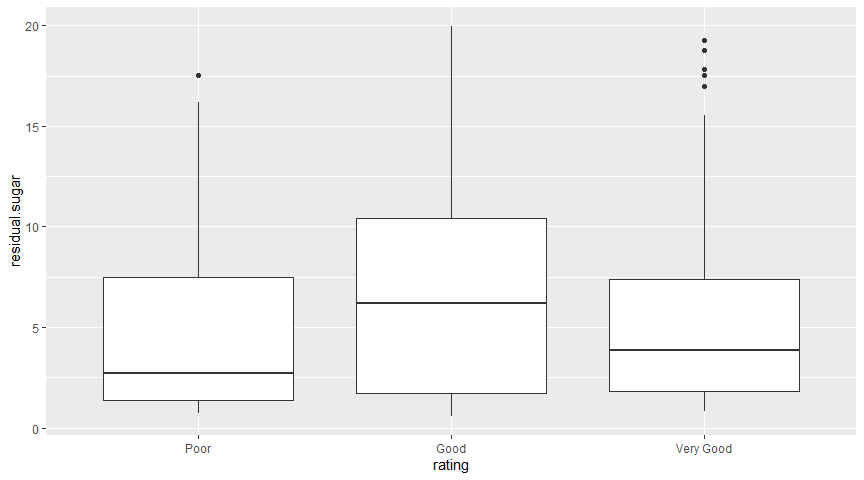

```
## # A tibble: 3 x 4
##   rating    sugar_mean sugar_median     n
##   <fct>          <dbl>        <dbl> <int>
## 1 Poor            4.82         2.7    183
## 2 Good            6.71         6.2   3637
## 3 Very Good       5.26         3.88  1060
```
Interestingly, "Very Good" wines have mean and median levels that fall somewhere
in between the sugar levels of "Poor" and "Good" wines. Even so, less sweet 
wines seem to generally rate higher.

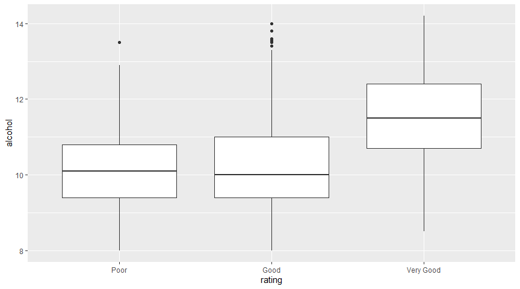

```
## # A tibble: 3 x 4
##   rating    alcohol_mean alcohol_median     n
##   <fct>            <dbl>          <dbl> <int>
## 1 Poor              10.2           10.1   183
## 2 Good              10.3           10    3655
## 3 Very Good         11.4           11.5  1060
```
"Very Good" alcohol seems to have slightly more alcohol than the others.

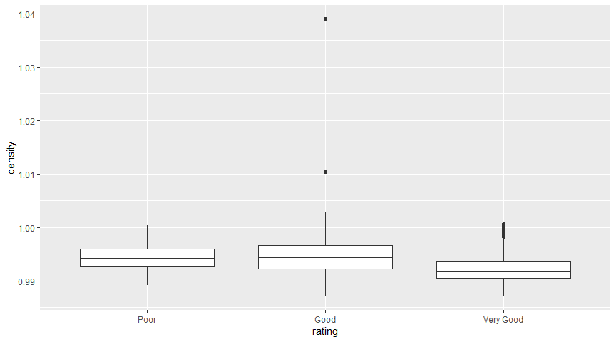

```
## # A tibble: 3 x 4
##   rating    density_mean density_median     n
##   <fct>            <dbl>          <dbl> <int>
## 1 Poor             0.994          0.994   183
## 2 Good             0.994          0.994  3655
## 3 Very Good        0.992          0.992  1060
```
The difference in wine density is extremely small but, "Very Good" wine is still slightly less thick than "Poor" and "Good".

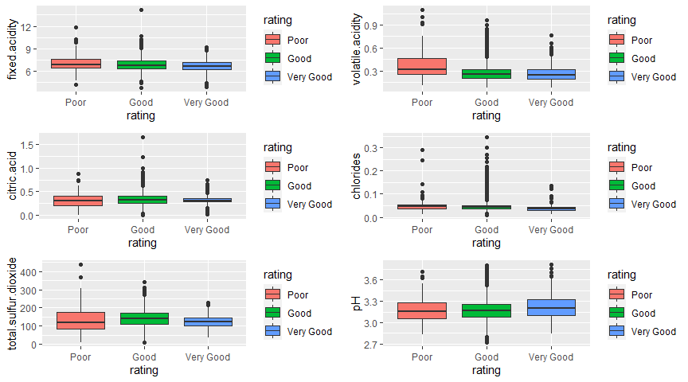

There are quite a few outliers making these plots hard to see.
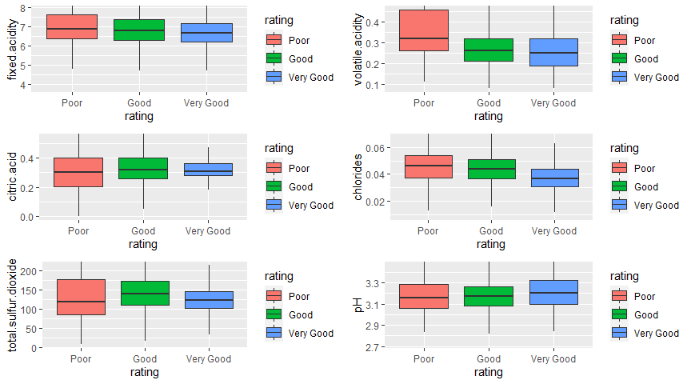

After removing the outliers from these plots, it looks as if the following is preferred to get a "Very Good" rating:

- Lower amounts of fixed acidity, volatile acidity, and chlorides

- A higher pH

Let's confirm. What if we looked at these closer by comparing these attributes with numeric quality ratings?


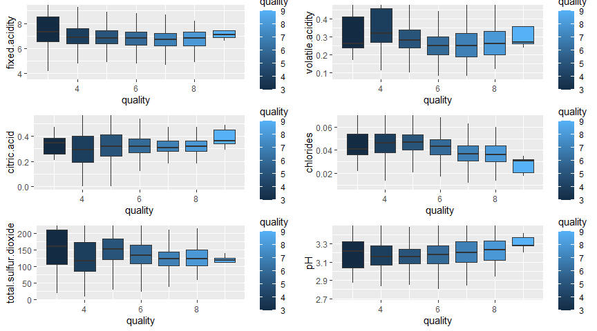

Just by looking at these plots, the highest rated white wines still have lower amounts of chlorides and higher pH levels. They also have a higher levels of fixed acidity and citric acid which doesn't align with the previous box plots that are grouped into ratings. 

```
##                              [,1]
## fixed.acidity        -0.113662831
## volatile.acidity     -0.194722969
## citric.acid          -0.009209091
## chlorides            -0.209934411
## total.sulfur.dioxide -0.174737218
## pH                    0.099427246
```
The most significant correlation is chlorides. The amount of chlorides in wine decreases as ratings increase.

# Bivariate Analysis


### Relationships of Interest

The main goal of this analysis was to focus on how the chemical attributes
of white wine affect the quality of wine. Comparisons were made to the grouped ratings and the numerical quality ratings. Alcohol, density, and chlorides seem to impact quality. A preferred higher alcohol, lower density, and lower chlorides (salt) in wine was not surprising. What was surprising was the relationship between quality and the different acids 
(fixed acidity, volatile acidity) because they didn't seem to have a clear impact on quality. Citric acid in higher amounts, however, did result in higher quality scores.
 

### Observations Outside of Original Focus 

There were strong correlations between residual sugar in comparison to density
and alcohol content in comparison to density. Residual sugars increased 
alongside density. Also wines with more sugar left behind, contained less
alcohol. What is interesting about the relationship between residual sugar and
density is that  residual sugar doesn't seem to be the only contribution factor
in how dense a wine is. Some wines had lower sugar levels while having a density greater than water.

### Strong Relationships

Overall, the strongest relationships in regards to quality were pH and 
chlorides. The wine experts gave higher ratings to wines with a lower chloride
amount and a higher pH when compared to the other wines being tasted.


# Multivariate Plots Section

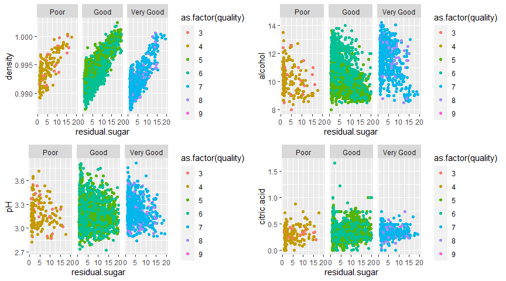

The relationship between residual sugar and density by rating and quality shows a positive correlation. 

The negative correlation between residual sugar and alcohol by rating and quality can also be seen although it is not as strong.

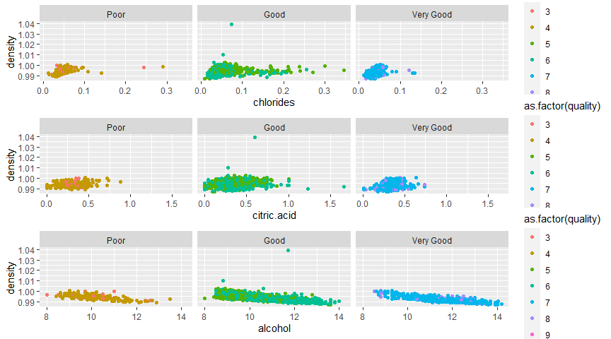

There seems to be a slight correlation between chlorides and density by quality and rating. The relationship is not strong but, wines rated "Poor" and "Good" have more wines with higher levels of chlorides than wines rated "Very Good".

Citric acid does not seem to have an impact on density but, some of the highest rated wines do have more citric acid than than those rated lower.

Higher levels of alcohol make wine less dense and seem to contribute to better quality scores and ratings.

# Multivariate Analysis

### Relationships Observed

These plots further explored residual sugars, density, alcohol,chlorides, citric acid and pH and how their relationships with quality and ratings. The findings were the same as previously investigated relationships. As alcohol levels increase, density decreases. As the amount of residual sugars increase, density increases. The features explored did not clearly help answer the question of what makes a quality wine. 

### Interesting or Surprising Interactions Between Features?

The plots show that there may be slight correlation between chlorides and density which could help explain why some wines with low residual sugars had a higher level of density.


# Final Plots and Summary

### Wine Quality Scores

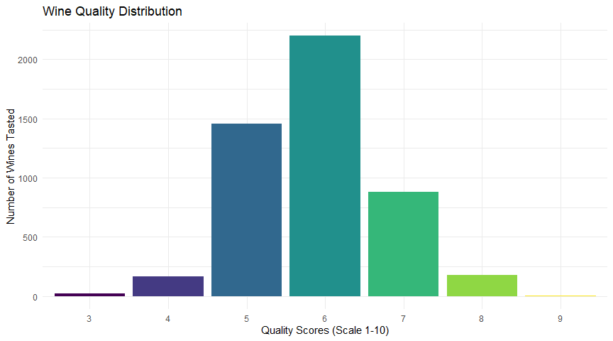


The majority of white wines being tested scored a 6. No wines had a score under 3 or a perfect 10. All the wines scored somewhere in the middle of the distribution.


### Relationship Between Alcohol and Ratings

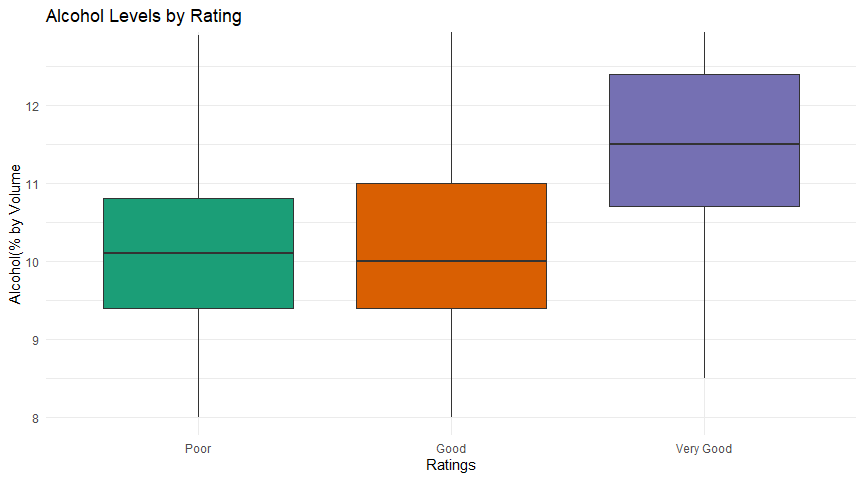

White wines with higher alcohol by volume generally received a better rating than wines with less alcohol content


### Residual Sugar and Density by Quality Score and Rating

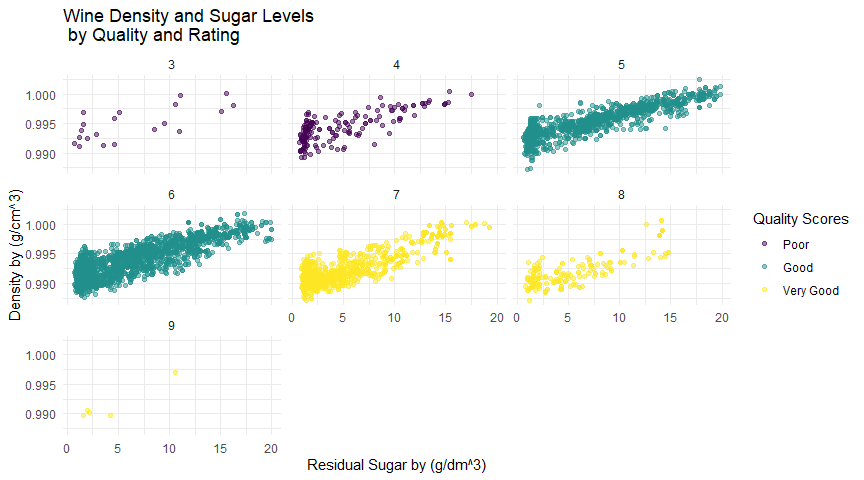

This positive correlation suggests residual sugar contributes to a change in density. The density increases when there is more residual sugars in the wine. However, it is still unclear as to whether these attributes directly impact quality and ratings. Although the "Very Good" wines with a quality score of 9 have less than 15 g/dm^3 of residual sugar and are less dense than water, so are other wines with lower ratings and quality scores.

# Reflection

After exploring various attributes of white wine, it can be seen that there are some strong relationships between different chemicals. While trying to pinpoint what makes a great wine, the relationships are not as clear. Tastes in wine may be dependent upon the person doing the tasting. Some of the same attributes that made a wine of good quality were also seen in poorer quality wines. No perfect combination was found through this analysis. Perhaps if the data had columns for what each expert scored the wine, more insights could have been made as to their individual tastes. That in comparison to the average score would allow us to see if the overall score was in fact a fair representation. If two experts gave a wine a score of 10 but, the third expert gave the wine a score of 1, the average score would be a 7. This would then inadvertently change the results of analysis on the data when looking for a high quality wine. Averages, in this case, do not tell the whole story.

In future explorations, more multivariate exploration with the chemical make up the wines could reveal more information about a high quality wine but, the results from this analysis were too scattered to know for certain. In addition, obtaining further information about what comprises making white wines or wines in general may have been helpful when comparing chemical components with one another.  


# Resources

- [http://www.sthda.com/english/wiki/correlation-matrix-a-quick-start-guide-to-analyze-format-and-visualize-a-correlation-matrix-using-r-software](http://www.sthda.com/english/wiki/correlation-matrix-a-quick-start-guide-to-analyze-format-and-visualize-a-correlation-matrix-using-r-software)

- [https://www.stat.cmu.edu/~cshalizi/rmarkdow/#code-chunks-and-their-results](https://www.stat.cmu.edu/~cshalizi/rmarkdown/#code-chunks-and-their-results)

- [https://www.usgs.gov/special-topic/water-science-school/science/water-density](https://www.usgs.gov/special-topic/water-science-school/science/water-density)

- [https://www.datanovia.com/en/blog/top-r-color-palettes-to-know-for-great-data-visualization/](https://www.datanovia.com/en/blog/top-r-color-palettes-to-know-for-great-data-visualization/)

